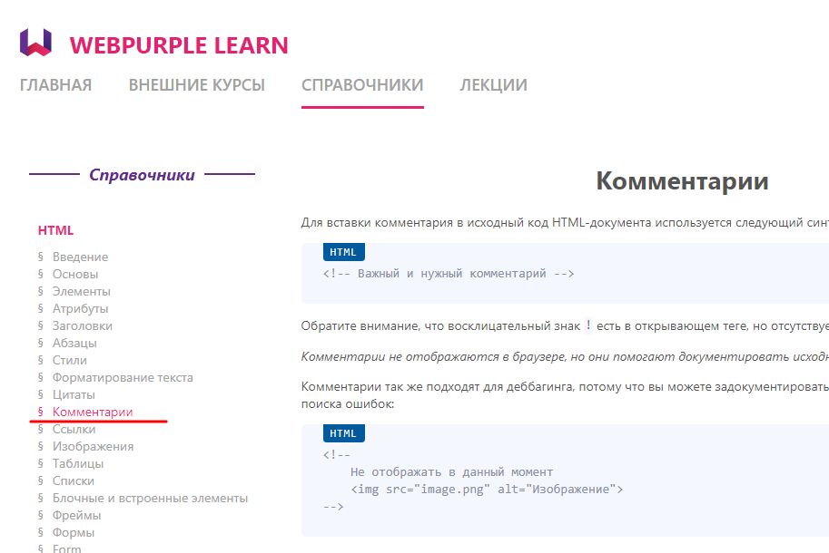
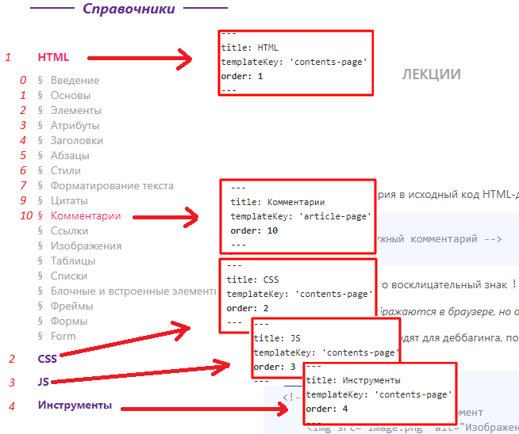
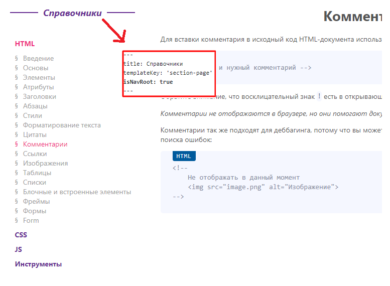

# Contributing WebPurple Learn

Thanks for taking the time to contribute!🎉
You can find a list of issues you can work on [here](https://github.com/WebPurple/learn/issues). Feel free to create new ones.

In general, the contribution workflow looks like this:

1. Fork the repo.

2. Create a new feature branch based off the `master` branch.

*Branch name examples*:
- `feature/materials`
- `feature/algolia-search`

3. Submit a pull request, referencing any issues it addresses.

To create commit messages use general [commits convention](https://www.conventionalcommits.org/en/v1.0.0/)

Please try to keep your pull request focused in scope and avoid including unrelated commits.

You can read more about contributing [here](https://guides.github.com/activities/contributing-to-open-source/).

## Materials Pages Configuration

All materials are stored in the directory [src/pages](https://github.com/WebPurple/learn/tree/master/src/pages). 

Site Navigation = structure in this directory (**If correctly describe files with materials**)

There are some options to configure page: 
- title
- templateKey
- order
- isNavRoot
- navTitle

### Page config example:

[link to the article](https://github.com/WebPurple/learn/blob/master/src/pages/dictionaries/html/10_html_comments.md)

```md
---
title: Комментарии
templateKey: 'article-page'
order: 10
---
```

## what does each of the options mean

### title

**Required**

Page Title.
Also used as Page main Header 


### templateKey 

**Required**

The Template that is used to render the page.

Generally you have to use **article-page** temlate - template of simple article 

Also there are **section-page** and **contents-page** templates. 

#### Examples

[section-page](https://github.com/ZeninZenin/WebPurple-learn/blob/master/src/pages/dictionaries/index.md)

[contents-page](https://github.com/ZeninZenin/WebPurple-learn/blob/master/src/pages/dictionaries/css/index.md)

### navTitle

**Optional**

Title of a navigation Link to the Page.

If not defined, used **title**



### order

**Optional**

The number in order the page link should be displayed in navigation. 

You have to define this option if order is important



### isNavRoot

**Optional**

Defines root of navigation for all child links.

When navigation bar is being rendering on some page, it finds the closest parent link with **isNavroot: true** and shows navogation starting with it.

#### Example 

Navigation starts from `/dictionaries`. Not from `/`


