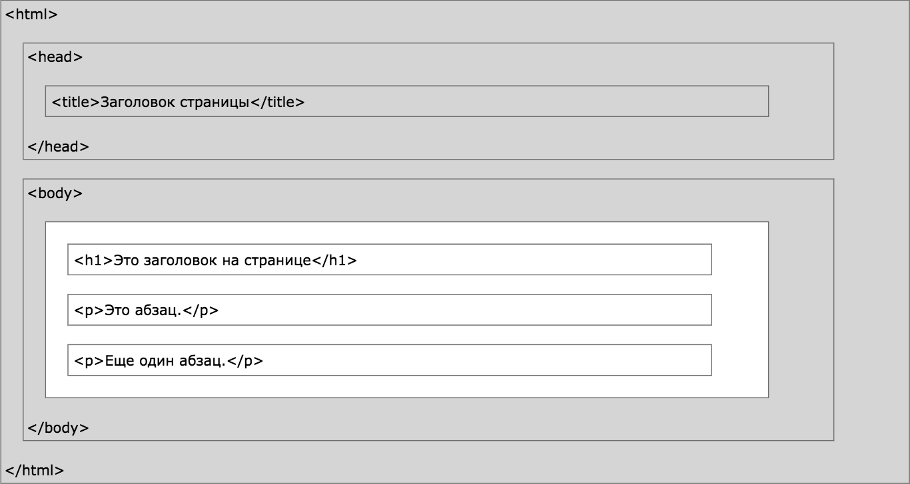

# Введение.

## HTML - это язык для создания Web-страниц.

- HTML расшифровывается как язык гипертекстовой разметки
- HTML описывает структуру Web-страниц при помощи разметки
- HTML-элементы - это блоки, из которых строятся HTML-страницы
- HTML-элементы представляются тегами
- HTML-теги - это части содержимого, такие как [заголовки](../html_headings), [абзацы](html_paragraphs), [таблицы](html_tables) и т.д.
- Браузеры не отображают сами теги, но используют их для отображения содержимого страницы

### Пример HTML-документа

```html
<!DOCTYPE html>
<html>
    <head>
        <title>Заголовок страницы</title>
    </head>
    <body>
        <h1>Мой первый заголовок</h1>
        <p>Мой первый абзац.</p>
    </body>
</html>
```

- Элемент `<!DOCTYPE html>` определяет тип документа
- Элемент `<html>` является корневым элементом HTML-страницы
- Элемент `<head>` содержит мета-информацию о странице
- Элемент `<title>` определяет заголовок страницы
- Элемент `<body>` содержит видимое содержимое страницы
- Элемент `<h1>` определяет большой заголовок
- Элемент `<p>` определяет абзац

## HTML-теги

HTML-теги - это имена элементов внутри угловых скобок:

```html
<tagname>содержимое элемента...</tagname>
```

- HTML-теги обычно существуют в парах, например, `<p>` и `</p>`. Но есть и одиночные теги, такие как ``
- Первый тег является открывающим, второй - закрывающим
- Закрывающий тег пишется как открывающий, но с символом `/` перед именем тега

[_Подробнее об HTML-элементах_](html_elements)

## Структура HTML-страницы



_Только содержимое тега `<body>` (белая область) отображается в браузере_
