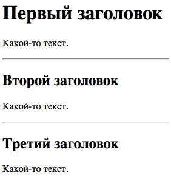

# Заголовки

Заголовки задаются тегами `<h1>` - `<h6>`.

Тег `<h1>` соответствует наиболее важному заголовку на странице, а `<h6>` - наименее важному.

```html
<h1>Заголовок 1</h1>
<h2>Заголовок 2</h2>
<h3>Заголовок 3</h3>
<h4>Заголовок 4</h4>
<h5>Заголовок 5</h5>
<h6>Заголовок 6</h6>
```

> 

_Браузеры автоматически добавляют отступы до и после заголовка_

## Значимость заголовков

Поисковые системы используют заголовки для индексации структуры и содержимого ваших web-страниц. Поэтому важно использовать заголовки только по предназначению.

Использовать заголовки на странице следует начинать с заголовка первого уровня `<h1>`, затем `<h2>` и т.д., не пропуская уровни.

## Горизонтальное правило, тег `<hr>`

Тег `<hr>` задает тематическое разбиение web-страницы и отображается, как правило, в виде горизонтальной линии.

```html
<h1>Первый заголовок</h1>
<p>Какой-то текст.</p>
<hr>
<h2>Второй заголовок</h2>
<p>Какой-то текст.</p>
<hr>
<h2>Третий заголовок</h2>
<p>Какой-то текст.</p>
```

> 
