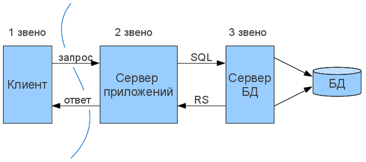

# Form

Формы используются для получения информации, вводимой пользователем.

Элементами форм являются различные типы инпутов:

- чекбоксы
- radio-кнопки
- submit-кнопки
- и др.

HTML-форму определяет тег `<form>`.

Форма сама по себе не видна на странице, отображаются только ее элементы.

Форма представляет собой множество полей для текстового ввода, кнопки и т.д., содержимое которых отправляется на сервер. Сервер обрабатывает полученную информацию и возвращает ответ пользователю при необходимости.

Форма предназначена для обмена данными между пользователем и сервером. Документ может содержать множество форм, но одновременно на сервер может быть отправлена только одна.


   
## Атрибуты формы

### Action attrubute

Форме указывается атрибут `action`, определяющий действие при сабмите формы. Сабмит обычно происходит при нажатии кнопки сабмита. Чаще всего форма отправляется веб-серверу. Если атрибут не указан, в действии указывается текущая страница.

[example](http://jsbin.com/voseni/edit?html,output)

### Method attribute

Атрибут метода определяет HTTP-метод (GET или POST), используемый при сабмите формы.

```html
<form action="action_page.php" method="get">
```

или

```html
<form action="action_page.php" method="post">
```

Метод GET используется, когда отправка формы происходит пассивно и в ней не содержится важной информации, т.к. в этом случае информация формы будет видна в адресе страницы: `action_page.php?firstname=Mickey&lastname=Mouse`. Метод подходит для небольших объймов данных. Ограничения на размер установлены в бразуерах.

Метод POST используется при обновлении данных и при наличии важной информации в форме (например, пароли). Метод предоставляет большую безопасность информации.

### Name attribute

Определяет уникальное имя формы. Как правило, имя формы используется для доступа к ее элементам через скрипты.

```html
<form action="action_page.php" name="form1"></form>
```

### Список атрибутов форм

HTML-форма со всеми установленными атрибутами выглядит следующим образом:

```html
<form action="action_page.php" method="GET" target="_blank" accept-charset="UTF-8"
    enctype="application/x-www-form-urlencoded" autocomplete="off" novalidate>
    <!-- form elements here -->
</form>
```

<table>
    <tbody>
    <tr>
        <th>Атрибут</th>
        <th>Описание</th>
    </tr>
    <tr>
        <td>accept-charset</td>
        <td>Определяет кодировку, используемую на форме (по умолчанию: кодировка страницы)</td>
    </tr>
    <tr>
        <td>action</td>
        <td>Определяет адрес для сабмита формы (по умолчанию: адрес текущей страницы)</td>
    </tr>
    <tr>
        <td>autocomplete</td>
        <td>Определяет, должен ли браузер автодополнять форму (по умолчанию: да)</td>
    </tr>
    <tr>
        <td>enctype</td>
        <td>Определяет кодировку данных (по умолчанию: url-encoded)</td>
    </tr>
    <tr>
        <td>method</td>
        <td>Определяет HTTP-метод для сабмита (по умолчанию: GET)</td>
    </tr>
    <tr>
        <td>name</td>
        <td>Определяет имя для идентификации формы (document.forms.name)</td>
    </tr>
    <tr>
        <td>novalidate</td>
        <td>Определяет, должен ли браузер валидировать форму</td>
    </tr>
    <tr>
        <td>target</td>
        <td>Определяет цель в адресе атрибута действия (по умолчанию: _self)</td>
    </tr>
    </tbody>
</table>

## Элементы форм

### Элемент `<input>`

Элемент `<input>` является самым распространенным. Он принимает атрибут `type`, который определяет его тип.

<table>
    <tbody>
    <tr>
        <th>Тип</th>
        <th>Описание</th>
    </tr>
    <tr>
        <td>text</td>
        <td>Поле текстого ввода. По умолчанию, ширина текстового поля равна 20 символам.</td>
    </tr>
    <tr>
        <td>radio</td>
        <td>Радио-кнопка. Радио-кнопки позволяют пользователю выбрать один из предложенных вариантов.</td>
    </tr>
    <tr>
        <td>submit</td>
        <td>Кнопка сабмита формы</td>
    </tr>
    </tbody>
</table>

[Подробнее](http://htmlbook.ru/html/input/type).

### Select

Элемент определяет список выбираемых опций (`<option>`).

[Подробнее](http://htmlbook.ru/html/select).

### Textarea

Элемент определяет многострочное поле ввода.

[Подробнее](http://htmlbook.ru/html/textarea).

### Button

Элемент определяет кнопку.

[Подробнее](http://htmlbook.ru/html/button).

### Datalist

Элемент задает список предопределенных опций для элемента `<input>`.

```html
<form action="action_page.php">
  <input list="browsers">

  <datalist id="browsers">
    <option value="Internet Explorer">
    <option value="Firefox">
    <option value="Chrome">
    <option value="Opera">
    <option value="Operaaaa">
    <option value="Safari">
  </datalist>
</form>
```

[Подробнее](http://htmlbook.ru/html/datalist).

### Label

Элемент служит подписью к другим элементам. Хорошим тоном считается изменение этих элементов при клике на label, например, установка чекбокса.

Для этого используются два метода:

- Использовать атрибут `for` и id нужного элемента

- Разместить элемент внутри контейнера `<label>`

[example](http://jsbin.com/xoxihi/edit?html,output)

### Fieldset

Для группировки элементов используется `<fieldset>`. Подпись к группе элементов определяет тег `<legend>`.

[example](http://jsbin.com/suvani/edit?html,output)

## Атрибуты инпутов

Все атрибуты `<input>` можно найти на [htmlbook](http://htmlbook.ru/html/input). Далее приведено их краткое описание.

### Атрибут `value`

Отвечает за стартовое значение поля.

### Атрибут `readonly`

Определяет поле только для чтения, т.е. с неизменяемым значением.

### Атрибут `disabled`

Выключает поле, делая его неиспользуемым и некликабельным. Такое поле не будет сабмититься.

### Атрибут `size`

Определяет размер (в символах) текстового поля.

### Атрибут `maxlength`

Ограничивает количество символов, вводимых в инпут.

## Атрибуты, введенные в HTML5

В HTML5 были введены следующие атрибуты для `<input>`:

- autocomplete
- autofocus
- form
- formaction
- formenctype
- formmethod
- formnovalidate
- formtarget
- height and width
- list
- min and max
- multiple
- pattern (regexp)
- placeholder
- required
- step
- and the following attributes for <form>:
- autocomplete
- novalidate

### Атрибут `autocomplete`

При включенном `autocomplete` браузер будет автоматически завершать ввод на основе вводимой ранее информации. Можно разрешить `autocomplete` для всей формы и отключить для конкретных полей ввода, или наоборот. Атрибут устанавливается для формы и следующих типов инпутов: `text`, `search`, `url`, `tel`, `email`, `password`, `datepickers`, `range` и `color`.

### Атрибут `novalidate`

Атрибут является атрибутом формы и отменяет валидацию данных при сабмите формы.

### Атрибут `autofocus`

При загрузке страницы элемент с этим атрибутом автоматически получает фокус.

### Атрибут `form`

Атрибут определяет одну или несколько форм, которым принадлежит данный инпут. При указании нескольких форм их ID перечисляются через пробелы.

### Атрибут `formaction`

Определяет URL файла, который обрабатывает данные при сабмите формы. Атрибут переопределяет атрибут `action` формы. Атрибут используется вместе с инпутами, типы который `submit` и `image`.

### Атрибут `formenctype`

Атрибут определяет, как данные формы должны быть закодированы, когда они отправляются на сервер (только для форм с методом `POST`). Атрибут переопределяет атрибут `enctype` формы.

### Атрибут `formmethod`

Атрибут определяет HTTP-метод для отправки данных формы по URL, указанному в `action`. Атрибут переопределяет атрибут `method`.

### Атрибут `formnovalidate`

Отменяет встроенную проверку данных на корректность, переопределяет атрибут `novalidate`.

### Атрибут `formtarget`

Определяет окно или фрейм в которое будет загружаться результат, возвращаемый обработчиком формы, переопределяет атрибут `target`.

### Атрибуты `height` и `width`

Атрибуты `height` и `width` определяют высоту и ширину элемента `<input>`. Используются только с `<input type="image">`.

### Атрибут `list`

Ссылается на `<datalist>` и содержит предопределенные опции для `<input>`.

### Атрибуты `min` и `max`

Атрибуты `min` и `max` определяют минимальное и максимальное значения для `<input>`. Используются с инпутами следующих типов: `number`, `range`, `date`, `datetime`, `datetime-local`, `month`, `time` и `week`.

### Атрибут `multiple`

Разрешает пользователю выбрать несколько значение элемента `<input>`. Работает с `email` и `file`.

### Атрибут `pattern`

Атрибут определает [регулярное выражение](https://developer.mozilla.org/ru/docs/Web/JavaScript/Guide/Regular_Expressions) для проверки введенных данных в инпут. Работает со следующими типами: `<input>`: `text`, `search`, `url`, `tel`, `email` и `password`.

Можно использовать атрибут `title` для подсказки пользователю, какая информация допустима, например:

```html
<input type="text" name="country_code" pattern="qwe" title="Only qwe is allowed">
```

### Атрибут `placeholder`

Атрибут `placeholder` служит подсказкой ожидаемого значения текстового поля. Подсказка отображается в текстовом поле перед вводом текста пользователем. Атрибут работает со следующими типами: `text`, `search`, `url`, `tel`, `email` и `password`.

### Атрибут `required`

Определяет поле как обязательное для заполнения перед сабмитом формы. Работает со следующими типами `<input>`: `text`, `search`, `url`, `tel`, `email`, `password`, `date pickers`, `number`, `checkbox`, `radio` и `file`.

### Атрибут `step`

Определяет численные интервалы для инпута. Атрибут устанавливается для следующих типов инпутов: `number`, `range`, `date`, `datetime`, `datetime-local`, `month`, `time` и `week`.

Можно использовать с атрибутами `min` и `max` для создания диапазона возможных значений.
