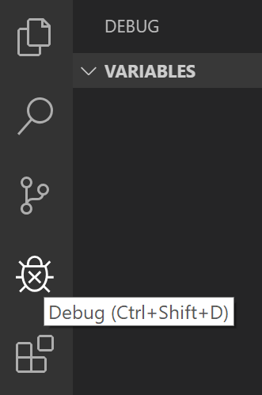

# Отладка программы

Одной из ключевых особенностей Visual Studio Code является отличная поддержка отладки. Отладчик (_debugger_), встроенный в VS Code, позволяет ускорить редактирование, компиляцию и отладочный цикл.


## Расширения для отладки

VS Code имеет встроенную поддержку отладки для среды выполнения Node.js и может отлаживать JavaScript, TypeScript, и другие языки, которые [транспилируются](http://www.geekhours.com/2017/03/08/difference-compiling-transpiling/) в JavaScript " Code имеет встроенную поддержку отладки для среды выполнения Node.js и может отлаживать JavaScript, TypeScript, и другие языки, которые [транспилируются".

Для отладки других языков и сред исполнения (включая _PHP, Ruby, Go, C#, Python, C++, Powershell_ и пр.) необходимо установить плагин под интересующий язык/среду из [магазина расширений Microsoft](https://marketplace.visualstudio.com/search?target=vscode&category=Debuggers&sortBy=Downloads) для VS Code в **категории Дополнительные отладчики** "я отладки других языков и сред исполнения (включая _PHP, Ruby, Go, C#, Python, C++, Powershell_ и пр.) необходимо установить плагин под интересующий язык/среду из [магазина расширений Microsoft".

## Начало отладки

Далее приведен пример отладки Node.js приложения и показаны основные возможности.
Для начала нужно установить Node.js на компьютер. Код приложения будет находится в файле `app.js` и будет выглядеть следующим образом:

```javascript
const msg = 'Hello world';
console.log(msg);
```

## Интерфейс отладки

Для отображения интерфейса отладки необходимо нажать на иконку отладки слева, на панели действий (**Activity Bar**) VS Code или воспользоваться сочетанием клавиш `Ctrl+Shift+D`.



В выбранном окне отображается вся информация, относящаяся к отладке, верхняя панель с командами отладки и настройками конфигурации.

## Меню отладки

Меню **Debug** верхнего уровня содержит наиболее распространенные команды отладки.


## Конфигурация запуска

Для отладки простейших приложений достаточно нажать `F5` и VS Code попробует отладить текущий выбранный файл.

Однако, для большинства сценариев работы с отладкой более удобным является написание и сохранение конфигурации настроек отладчика. VS Code хранит конфигурационную информацию для отладичка в файле `launch.json`, находящимся в директории `.vscode` (по-умолчанию) рабочей области (корневой папки проекта), либо в [пользовательских настройках](https://code.visualstudio.com/docs/editor/debugging#_global-launch-configuration) или [настройках рабочей области](https://code.visualstudio.com/docs/editor/multi-root-workspaces#_workspace-launch-configurations) "нако, для большинства сценариев работы с отладкой более удобным является написание и сохранение конфигурации настроек отладчика. VS Code хранит конфигурационную информацию для отладичка в файле `launch.json`, находящимся в директории `.vscode` (по-умолчанию) рабочей области (корневой папки проекта), либо в [пользовательских настройках](https://code.visualstudio.com/docs/editor/debugging#_global-launch-configuration) или [настройках рабочей области".

Для создания `launch.json` необходимо открыть в VS Code папку с проектом (**Файл > Открыть папку...**), а затем нажать на иконку шестеренки на верхней панели отладочного меню.


VS Code попытается автоматически определить требуемую среду отладки, но если это не получится, необходимо выбрать ее вручную.


Далее представлена автоматически сгенерированная конфигурация для запуска отладчика Node.js.

```json
{
    "version": "0.2.0",
    "configurations": [
        {
            "type": "node",
            "request": "launch",
            "name": "Launch Program",
            "program": "${file}"
        }
    ]
}
```

Если вернуться к Проводнику (`Ctrl+Shift+E`), то можно увидеть, что VS Code создал директорию `.vscode` и добавил файл `launch.json` в рабочую область.


> **Примечание:** можно отлаживать простое приложение, даже без открытой папки в VS Code, но в таком случае невозможно управлять конфигурацией запуска и расширенными настройками отладки. Строка состояния (Status Bar) VS Code становится фиолетовой, если папка не была открыта.

Стоит отметить, что атрибуты, доступные в конфигурациях запуска, варьируются в зависимости от отладчика. Для получения возможных атрибутов для конкретной конфигурации удобно использовать IntelliSense (`Ctrl+Space`), для полного описания атрибута — подсказки при наведении на него.


Обычно отладчики VS Code поддерживают запуск программы в режиме отладки или подключение к уже запущенной программе в режиме отладки (атрибут request: `attach` | `launch`).

Для добавления новой конфигурации в существующий `launch.json`, можно воспользоваться одним из перечисленных подходов:

-   используя IntelliSense внутри объекта массива "configurations"
-   нажатием на клавишу **Добавить конфигурацию...** для вызова сниппета и добавления элемента в начале массива
-   выбора элемента **Добавить конфигурацию...** из элемента выпадающего списка вверху настроек интерфейса отладки.


VS Code так же поддерживает запуск составных конфигураций для запуска нескольких конфигураций одновременно. [Подробнее...](https://code.visualstudio.com/docs/editor/debugging#_compound-launch-configurations " Code так же поддерживает запуск составных конфигураций для запуска нескольких конфигураций одновременно. [Подробнее...")

Для того, чтобы начать сеанс отладки сначала нужно выбрать конфигурацию в выпадающем списке в интерфейсе отладки. После того, как конфигураци выбрана нажать `F5`.

Как только сеанс отладки начнется снизу VS Code отобразится Консоль отладки, с отладочной информацией, а Строка состояния окрасится в оранжевый цвет.


Кроме того, в строке состояния отображается статус отладки, отображающий активную конфигурацию отладки. Нажимая на статус отладки, пользователь может изменить активную конфигурацию и начать отладку без необходимости переходить в интерфейс Отладки.


## Действия при отладке

Как только сеанс отладки начнется в верхней части экрана появится **Панель инструментов** (Debug Toolbar) отладки.


-   Продолжить / Приостановить `F5`
-   Шаг с обходом `F10`
-   Шаг с заходом `F11`
-   Шаг с выходом `Shift+F11`
-   Перезапустить `Ctrl+Shift+F5`
-   Остановить `Shift+F5`

## Точки останова (Breakpoints)

Точки останова могут быть переключены с левого отступа редактора. Более гибкое управление точкой останова (включение / выключение / повторное использование) можно выполнить в разделе **ТОЧКИ ОСТАНОВА** (BREAKPOINTS) в верхнем меню.

-   Точки останова в поле редактора обычно отображаются в виде красных заполненных кругов.
-   Отключенные контрольные точки имеют заполненный серый круг.
-   Когда начинается сеанс отладки, точки останова, которые не могут быть зарегистрированы в отладчике, меняются на серый полый круг. То же самое может произойти, если источник отредактирован, когда выполняется сеанс отладки без поддержки Live-редактирования.

Команда **Повторно применить все точки останова** установит все точки останова в исходное местоположение. Это полезно, если среда отладки является «ленивой» и «ошибочной» точкой останова в исходном коде, который еще не был выполнен.


## Точки логирования (Logpoints)

Точка логирования — это вариант точки останова, которая не «ломается» в отладчике, а выводит сообщение на консоль. Они особенно полезны для ведения журнала при отладке производственных серверов, которые не могут быть приостановлены или остановлены.

Точка логирования представлена символом красного ромба. Сообщения журнала — это простой текст, но могут включать выражения, которые будут оцениваться в фигурных скобках ('{}').


Подобно обычным точкам останова, точки логирования можно включать или отключать, а также контролировать состояние и/или количество попаданий.

## Проверка данных

Переменные могут быть проверены в разделе **ПЕРЕМЕННЫЕ** (VARIABLES) в интерфейсе Отладки или путем наведения курсора на их объявление в редакторе. Введение переменных и выражений относительно выбранного кадра стека отображается в секции **СТЕК ВЫЗОВОВ** (CALL STACK).


Значения переменных могут быть изменены с помощью действия «Задать значение» из контекстного меню переменной.
