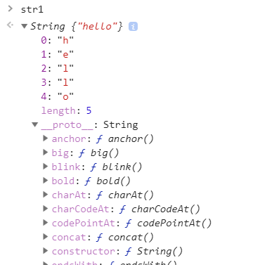

# Объекты в JavaScript. Часть 2

## Прототип

**Прототип (Prototype)** — это _объект_, служащий вспомогательным объектом (делегатом), к характеристикам которого может обратиться оригинальный объект, в случае, если сам оригинальный объект не обладает нужной характеристикой.

Каждый объект имеет ноль или несколько свойств, которые называются собственными(own) и единственную внутреннюю ссылку на прототип.

## Создание объекта с прототипом

**Object.create(proto)**

```js
var obj = {a: 1, b: 2};

var obj1 = Object.create(obj);
obj1.c = 3;

obj1.c; // 3 – значение собственного свойства c
obj1.a; //1 – значение свойства из прототипа
```

Когда объект не может ответить на сообщение самостоятельно (вернуть значение свойства), он обращается к своему прототипу (делегирует ему полномочия за ответ).

## Внутреннее свойство для прототипа объекта


Cвойство **\_\_proto\_\_** содержит внутреннюю ссылку на прототип объекта.

## Инициализация объекта с помощью литерала

```js
var obj = {a: 1};
```

При создании объекта через литерал, его прототипом автоматически становится специальный built-in объект, который уже содержит ряд методов для работы с объектом.

Данный прототип единственный и будет предоставлять доступ к своим методам всем объектам, созданным в программе!

Прототип хранит общий функционал и предоставляет к нему совместный доступ множеству объектов. Не нужно повторять один и тот же функционал в каждом объекте. Можно общие методы вынести в отдельный объект и через механизм прототипа обеспечить к нему совместный доступ.


## Собственные свойства объекта

```js
var obj = {a: 1, b: 2};

var obj1 = Object.create(obj);
obj1.c = 3;

for (var key in obj1) {
    console.log(key); // c ,a, b
}
```

Как можно выбрать только собственные свойства объекта?

**obj.hasOwnProperty(key)**

```js
for (var key in obj1) {
    if (obj1.hasOwnPropery(key)) {
        console.log(key); // c
    }
}
```

## Функция это тоже объект

Несмотря на то, что:

```js
var f = function() {};
typeof f; // 'function'
```

**Функция в JS это объект!**

Можно создавать свойства как в обычном объекте:

```js
var f = function() {};
f.static = 1000;
```

## Встроенные объекты

-   String
-   Number
-   Boolean
-   Object
-   Function
-   Array
-   Date
-   RegExp
-   Error

Объекты, которые предоставляет нам JS, которые уже существуют в глобальном пространстве и не зависят от среды выполнения (браузер или node.js).

```js
var str = 'hello';

var str1 = new String('hello');

str === str1; // false
typeof str; // string
typeof str1; // object

str.length; // 5
```

**Однако строки не являются объектами, так почему же они обладают свойствами?**

```js
var str1 = new String('hello');
```


```js
'hello'.length; // 5
```

Всякий̆ раз когда в программе предпринимается попытка обратиться к свойству строки str, JS преобразует строковое значение в объект, как если бы был выполнен вызов new String(str).

Этот объект используется интерпретатором для доступа к свойствам.

После обращения к свойству вновь созданный объект уничтожается.

## "Объекты-обертки"

Временные объекты, которые создаются при обращении к свойству строки, числа или логического значения, называются **объектами ­обертками**.

**Все методы** для работы со строками, числами, массивами и другими типами данных **храниться в прототипах** объектов оберток.



## [Методы String](https://developer.mozilla.org/ru/docs/Web/JavaScript/Reference/Global_Objects/String)

## [Методы Number](https://developer.mozilla.org/ru/docs/Web/JavaScript/Reference/Global_Objects/Number)

## [Объект Math](https://developer.mozilla.org/ru/docs/Web/JavaScript/Reference/Global_Objects/Math)
