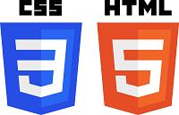

# HTML и CSS. Начальный уровень

## Содержание

### <gatsby-link to="/externals/topic7/html-basics">HTML</gatsby-link>

-   <gatsby-link to="/externals/topic7/html-basics#структура-страницы">Структура страницы</gatsby-link>
-   <gatsby-link to="/externals/topic7/html-basics#html-теги">HTML-теги</gatsby-link>
-   <gatsby-link to="/externals/topic7/html-basics#кодировка">Кодировка</gatsby-link>
-   <gatsby-link to="/externals/topic7/html-basics#dom">DOM</gatsby-link>
-   <gatsby-link to="/externals/topic7/html-basics#валидация">Валидация</gatsby-link>
-   <gatsby-link to="/externals/topic7/html-basics#полезные-ссылки">Полезные ссылки</gatsby-link>

### <gatsby-link to="/externals/topic7/css-basics">CSS</gatsby-link>

-   <gatsby-link to="/externals/topic7/css-basics#синтаксис">Синтаксис</gatsby-link>
-   <gatsby-link to="/externals/topic7/css-basics#селекторы">Селекторы</gatsby-link>
-   <gatsby-link to="/externals/topic7/css-basics#цвета">Цвета</gatsby-link>
-   <gatsby-link to="/externals/topic7/css-basics#фон">Фон</gatsby-link>
-   <gatsby-link to="/externals/topic7/css-basics#единицы-измерения">Единицы измерения</gatsby-link>
-   <gatsby-link to="/externals/topic7/css-basics#размеры-элементов">Размеры элементов</gatsby-link>
-   <gatsby-link to="/externals/topic7/css-basics#font">Font</gatsby-link>
-   <gatsby-link to="/externals/topic7/css-basics#text">Text</gatsby-link>
-   <gatsby-link to="/externals/topic7/css-basics#валидация">Валидация</gatsby-link>
-   <gatsby-link to="/externals/topic7/css-basics#полезные-ссылки">Полезные ссылки</gatsby-link>

## [Задания](https://github.com/WebPurple/external-courses/tree/master/src/ex8_html-css-basics/README.md)
