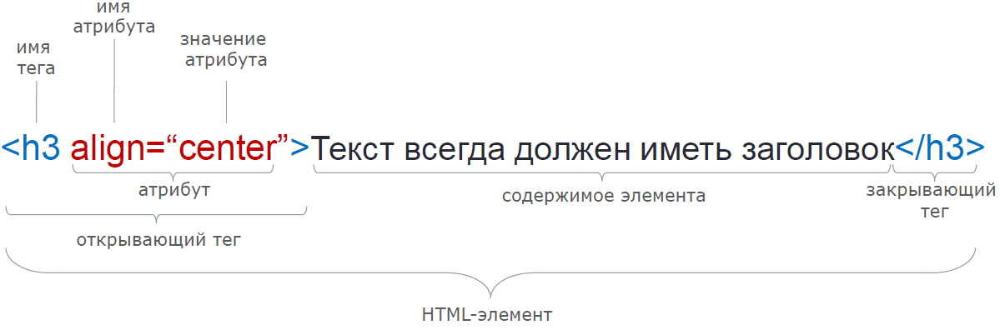

# HTML. Начальный уровень

**HTML** является аббревиатурой для Hyper Text Markup Language. Язык разметки HTML служит для описания веб-страниц. Он представляет собой набор тегов для разметки, которые описывают контент документа.

HTML-документы, также называемые веб-страницами, содержат HTML-теги и обычный текст.

HTML - язык разметки, что означает, что он предназначен для описания структуры веб-страницы, чтобы браузер знал, как ее отобразить. При посещении веб-страницы браузер отрисовывает код HTML.

Любой HTML-документ представляет собой множество элементов с открывающим и закрывающим **тегом**, т.е. специальным маркером, который определяет свойства отображения и расположения его внутреннего содержимого.

## Структура страницы

`html` - корневой элемент, начинающий и заканчивающий веб-страницу.

`head` - инструкции для браузера. Они не видны пользователю, кроме `<title>`. [Подробнее](http://htmlbook.ru/html/head).

`body` - содержит весь видимый контент. [Подробнее](http://htmlbook.ru/html/body).

Пример HTML-документа:

```html
<!DOCTYPE html>
<html>
  <head>
    <title>Page title goes here</title>
  </head>
  <body>
    Content goes here!
  </body>
</html>
```

`DOCTYPE` определяет тип документа и версию HTML, чтобы браузер корректно его обработал.

В процессе развития HTML было несколько версий языка, в настоящее время используется HTML5.

[См. подробнее](http://htmlbook.ru/html/%21doctype).

## HTML-теги

HTML-теги представляют собой ключевые слова, заключенные в угловые скобки, например, `<html>`.

Часто теги являются парными, т.е. существует открывающий (`<b>`) и закрывающий (`</b>`) теги.

Теги не являются регистрозависимыми, т.е. `<b>` воспринимается браузером так же, как и `<B>`. Однако рекомендуется использовать нижний регистр.

Каждый HTML-тег влияет на свое содержимое каким-либо образом. Например, тег `<i>` предназначен для отображения текста курсивом, тег `<h1>` определяет заголовок первого уровня, а тег `` предназначен для отображения на веб-странице изображения.

Все теги и их предназначение можно посмотреть [тут](http://htmlbook.ru/html).

### Атрибуты

Атрибуты используются для расширения возможностей тегов, для добавления гибкости и для управления содержимым контейнера.

Иными словами, тег говорит браузеру, **что** нужно сделать, а атрибут - **как**. Например, атрибут `align="center"` означает, что содержимое нужно выровнять по центру.



### Комментарии

Для вставки комментариев используются теги `<!--` и `-->`.

Комментарии не отображаются браузером. Они могут помочь в разработке и отладке HTML.

### Теги по цели

Теги можно разделить по цели их применения.

#### Заголовки

Заголовки позволяют разделить текст на секции.

[example](http://jsbin.com/fezoca/edit?html,output)

#### Списки

##### Маркированный список

Тег `<ul>` создает маркированный список. Каждый элемент списка должен быть заключен в парный тег `<li>`.

[example](http://jsbin.com/qacuca/edit?html,output)

##### Нумерованный список

Тег `<ol>` создает нумерованный список. Каждый элемент списка должен быть заключен в парный тег `<li>`.

[example](http://jsbin.com/kakuhu/edit?html,output)

##### Cписок определений

Тег `<dl>` создает список определений. Он включает тег `<dt>`, т.е. сам термин, и тег `<dd>`, т.е. определение термина.

[example](http://jsbin.com/lafune/edit?html,output)

##### Вложенные списки

Списки могут быть вложенными.

[example](http://jsbin.com/segiyu/edit?html,output)

#### Блоки

[См. подробнее о блочных элементах](../topic10/html-fundamentals#Блочные-элементы).

##### Division

Тег `<div>` (division) обозначает блочный элемент и предназначен для выделения части контента для его [стилизации](css-basics).

[example](http://jsbin.com/bocusa/edit?html,css,output)

##### Параграф

Тег `<p>` определяет параграф текста. По умолчанию параграфы разделены небольшими отступами, называемыми margin.

[example](http://jsbin.com/yuqemon/edit?html,output)

##### Горизонтальная линия

Тег `<hr>` (horizontal rule) добавляет горизонтальную линию. Не имеет закрывающего тега.

[example](http://jsbin.com/yucove/edit?html,output)

#### Таблицы

В HTML для создания таблицы используется тег `<table>`. Строки таблицы создаются с помощью тега `<tr>`, ячейки - `<td>`.

Например:

```html
  <table border="1">
  <tr>
<td>Table cell 1</td>
<td>Table cell 2</td>
  </tr>
  </table>
```

 <table border="1">
   <tr>
 <td>Table cell 1</td>
 <td>Table cell 2</td>
   </tr>
 </table>
 
 ### Заголовки
 
 Многие таблицы имеют заголовки. В HTML для этого используется тег `<th>`.
 
 ```html
   <table border="1">
 <tr>
   <th>Table header</th><th>Table header</th>
 </tr>
 <tr>
   <td>Table cell 1</td><td>Table cell 2</td>
 </tr>
   </table>
 ```
 
   <table border="1">
 <tr>
   <th>Table header</th><th>Table header</th>
 </tr>
 <tr>
   <td>Table cell 1</td><td>Table cell 2</td>
 </tr>
   </table>
 
 ### Colspan, rowspan
 
 Для того, чтобы ячейка таблицы объединяла несколько столбцов, используется атрибут `colspan`.
 
 Атрибут `rowspan` аналогичен `colspan`, но служит для объединения строк.
 
 ```html
 <table border="1">
 <tr>
   <th colspan="2">Table header</th>
 </tr>
 <tr>
   <td>Table cell 1</td><td>Table cell 2</td>
 </tr>
   </table>
 ```
 
 <table border="1">
 <tr>
   <th colspan="2">Table header</th>
 </tr>
 <tr>
   <td>Table cell 1</td><td>Table cell 2</td>
 </tr>
  </table>
 
 ### Части таблицы
 
 Таблицы могут быть разделены на три части: хедер (head), основную (body), футер (foot). Их предназначение аналогично соответствующим частям веб-страницы. Для их создания используются теги `<thead>`, `<tbody>`, `<tfoot>`.
 
 ```html
 <table border="1">
 
   <thead>
 <tr>
   <th colspan="2">Caption 1</th>
   <th>Caption 2</th>
 </tr>
   </thead>
 
   <tbody>
 <tr>
   <td>Row 1.1</td>
   <td>Row 1.2</td>
   <td>Row 1.3</td>
 </tr>
 <tr>
   <td>Row 2.1</td>
   <td colspan="2">Row 2.2</td>
 </tr>
 <tr>
   <td rowspan="2">Row 3.1</td>
   <td>Row 3.2</td>
   <td>Row 3.3</td>
 </tr>
 <tr>
   <td>Row 3.4</td>
   <td>Row 3.5</td>
 </tr>
   </tbody>
 
   <tfoot>
 <tr>
   <td colspan="3">Footer</td>
 </tr>
   </tfoot>
 
 </table>
 ```
 
 <table border="1">
   <thead>
 <tr>
   <th colspan="2">Caption 1</th>
   <th>Caption 2</th>
 </tr>
   </thead>
   <tbody>
 <tr>
   <td>Row 1.1</td>
   <td>Row 1.2</td>
   <td>Row 1.3</td>
 </tr>
 <tr>
   <td>Row 2.1</td>
   <td colspan="2">Row 2.2</td>
 </tr>
 <tr>
   <td rowspan="2">Row 3.1</td>
   <td>Row 3.2</td>
   <td>Row 3.3</td>
 </tr>
 <tr>
   <td>Row 3.4</td>
   <td>Row 3.5</td>
 </tr>
   </tbody>
   <tfoot>
 <tr>
   <td colspan="3">Footer</td>
 </tr>
   </tfoot>
 </table>
 
 ## Табличная верстка
 
 Верстка веб-страницы очень важна для лучшего отображения вашего сайта. Красивая и удобная верстка занимает достаточно много времени.
 
 В настоящее время все современные сайты используют CSS и JavaScript-фреймворки для создания динамической и адаптивной верстки, но все еще можно хорошо сверстать страницу используя таблицы или дивы (`<div>`).
 
 Разберемся, как верстать страницу, используя только HTML и атрибуты.
 
 ### 3 колонки
 
 ```html
 <table width="100%" border="0">
   <tr>
 <td style="background-color:#aaa" width="20%">
   <b>Main Menu</b><br />
   HTML<br>
   PHP<br>
   PERL...
 </td>
 <td style="background-color: #b5dcb3" height="200" width="60%">
 Technical and Managerial Tutorials
 </td>
 <td style="background-color:#aaa" width="20%">
   <b>Right Menu</b><br>
   HTML<br>
   PHP<br>
   PERL...
 </td>
</tr>
 <table>
 ```
 
 <table width="100%" border="0">
   <tr>
 <td style="background-color:#aaa" width="20%">
   <b>Main Menu</b><br />
   HTML<br>
   PHP<br>
   PERL...
 </td>
 <td style="background-color: #b5dcb3" height="200" width="60%">
 Technical and Managerial Tutorials
 </td>
 <td style="background-color:#aaa" width="20%">
   <b>Right Menu</b><br>
   HTML<br>
   PHP<br>
   PERL...
 </td>
</tr>
 </table>
 
 ### 3 строки, 2 колонки
 
 ```html
 <table width="100%" border="0">
   <tr>
 <td colspan="2" style="background-color: #b5dcb3">
   <h1>This is Web Page Main title</h1>
 </td>
   </tr>
   <tr>
 <td style="background-color: #aaa" width="50">
   <b>Main Menu</b><br />
   HTML<br />
   PHP<br />
   PERL...
 </td>
 <td style="background-color: #eee" width="100" height="200">
 Technical and Managerial Tutorials
 </td>
   </tr>
   <tr>
 <td colspan="2" style="background-color: #b5dcb3">
   Copyright © 2007 Tutorialspoint.com
 </td>
   </tr>
 </table>
 ```
 
 <table width="100%" border="0">
   <tr>
 <td colspan="2" style="background-color: #b5dcb3">
   <h1>This is Web Page Main title</h1>
 </td>
   </tr>
   <tr>
 <td style="background-color: #aaa" width="50">
   <b>Main Menu</b><br />
   HTML<br />
   PHP<br />
   PERL...
 </td>
 <td style="background-color: #eee" width="100" height="200">
 Technical and Managerial Tutorials
 </td>
   </tr>
   <tr>
 <td colspan="2" style="background-color: #b5dcb3">
   Copyright © 2007 Tutorialspoint.com
 </td>
   </tr>
 </table>
 
 ### Недостатки табличной верстки
 
 - Таблицы увеличивают размер файла разметки
 
 - Таблицы обычно мешают инкрементной отрисовке страницы, т.е. пройдет много времени, прежде чем пользователь что-либо увидит
 
 - Таблицы мешают копированию текста в некоторых браузерах
 
 - Табличная верстка занимает больше времени, чем верстка с помощью CSS
 
 - Семантически некорректно использовать таблицы для описания внешнего вида, а не контента
 
 - Таблицы усложняют пользование скринридерами
 
 - Табличная верстка делает дизайн менее гибким и изменяемым

#### Изображения

Для вставки изображений используется тег ``. Источник изображения определяется атрибутом `src`, текст, показываемый при отсутствии изображения, определяется атрибутом `alt`.

[example](http://jsbin.com/xivuli/edit?html,output)

#### Формы

Формы предназначены для ввода пользовательской информации и ее сохранения. Подробнее в [лекции № 11](../topic11).

#### Форматирование текста

Большинство данных тегов больше не используются. Для этой цели обычно используется CSS.

[example](http://jsbin.com/wubitu/edit?html,output)

[example](http://jsbin.com/wowaza/edit?html,output)

#### Ссылки

Для создания ссылок в документе служит тег `<a>`. Атрибут `href` определяет адрес документа, на который следует перейти, `name` устанавливает имя якоря внутри документа.

[example](http://jsbin.com/vuhume/edit?html,css,output)

## Кодировка

Важно упомянуть о кодировке символов веб-страницы. Для этого используется тег `meta`:

```html
<meta http-equiv="Content-Type" content="text/html; charset=encoding name">
```

Для операционных систем семейства Windows и кириллицы обычно используется utf-8 или windows-1251:

```html
<!DOCTYPE html>
<html>
  <head>
    <title>Encoding</title>
    <meta http-equiv="Content-Type" content="text/html; charset=utf-8">
  </head>
  <body>
    <p>
      Cyrillic
    </p>
  </body>
</html>
```

## DOM

После загрузки веб-страницы браузер создает DOM (Document Object Model) этой страницы. DOM представляет из себя дерево объектов.


Иерархия DOM:


## Валидация

Валидация используется для проверки документа на соответствие веб-стандартам и отсутствие ошибок. Эти стандарты называются спецификацией, которая разработана [W3C](https://www.w3.org/).

Программа-валидатор работает следующим образом: определяет тип документа (!DOCTYPE), проверяет корректность HTML-кода. В то же время проверяется правильное использование имен тегов.

Валидатор проверяет следующее:

1. Синтаксис
1. Вложенность тегов
1. DTD (Document Type Definition — определение типа документа)
1. Посторонние элементы

Если хотя бы один из тестов не пройден, HTML считается невалидным.

Главным преимуществом валидирования является проверка кроссбраузерности, т.е. корректного отображения документа во всех браузерах.

К недостаткам можно отнести лишнюю строгость иотсутствие поддержки специфичных требований.

Тем не менее, валидировать HTML-документы очень рекомендуется, т.к. это помогает обнаружить существующие уязвимости и писать корректный код.

Для валидации можно использовать [валидатор w3c](http://validator.w3.org/).

## Полезные ссылки

[Самоучитель HTML](http://htmlbook.ru/samhtml)

[Какие бывают META теги и зачем они нужны](https://habrahabr.ru/post/72141/)

[Метатеги](http://htmlbook.ru/content/metategi)
