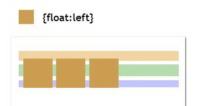
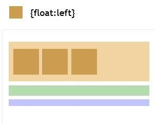

<p align="center">
    
</p>

# Основы CSS. Часть 1

## Каскад

CSS расшифровывается как Cascading Style Sheets, т.е. каскадные таблицы стилей. Уже само название показывает, как именно стили применяются к элементам документа.

CSS-каскад называется так, потому что объявления стилей "каскадируются" на элементы из многих источников.

Каскад комбинирует важность, происхождение, специфичность и порядок источников для принимаемых стилей, чтобы точно и безконфликтно определить, какой именно стиль должен быть применен к конкретному элементу.

Также в CSS действует наследование, благодаря которому элемент может получить какие-либо стили от родительского элемента, если они не определены для него. При этом не все свойства могут наследоваться. Например, свойство `font-size` передается потомкам, а `padding` - нет.

Каждое правило CSS две основные части — селектор и блок объявлений. Селектор расположен до знака `{` и определяет, на какие части документа (возможно, специально обозначенные) распространяется правило. Блок объявлений помещается в фигурные скобки, и, в свою очередь, состоит из одного или более объявлений, разделённых знаком `;`. Каждое объявление представляет собой сочетание свойства CSS и значения, разделённых знаком `:`. Селекторы могут группироваться в одной строке через запятую. В таком случае свойство применяется к каждому из них.

```css 
селектор, селектор {
  свойство: значение;
  свойство: значение;
  свойство: значение;
}
```

## Селекторы

### Селектор по тегу

Самый простой способ заключается в использовании названия тега. Например, ниже выбираются все заголовки первого уровня:

```css
h1 {
    ...;
}
```

### Селекторы по ID

Другой способ выбора части документа - использовать ID. Этот метод позволяет более гибко выбирать элементы страницы.

Для выбора уникального элемента используются ID. Помните, на странице **не должно быть более одного элемента с одинаковыми ID**.

```html
<div id="myIdForThisBlock">Aloha!</div>
```

```css
#myIdForThisBlock {
    ...;
}
```

Чаще всего `id` используют для поиска элементов из JS, поэтому вы можете увидеть, что имена `id` пишут в camelCase, так же `id` может использоваться для создания связей между элементами, например в `<label for="значение id блока" ...` или в ссылках внутри страницы. По этой причине **не рекомендуется** использовать селекторы по ID для задания стилей, чтобы разделять зону ответственности логики и стилевого оформления.

### Селекторы по классам

Такой селектор находит все элементы с определенным аттрибутом `class`.

```html
<h1 class="my-special-class">I will be selected</h1>
<span class="my-special-class">And me too!</span>
```

```css
.my-special-class {
    ...;
}
```


### Универсальный селектор

Также стоит упомянуть об универсальном селекторе `*`. Этот селектор позволяет выбрать абсолютно все элементы страницы.

```css
* {
    color: green;
}
```

### Группировка селекторов

Cелекторы можно группировать, например:

```css
h1.my-special-class {
    ...;
}
```

Эту будет значить выбери мне все `h1` у которых есть класс `my-special-class`.

### Селектор потомков

Чтобы выбрать какой-либо элемент, вложенный в другой, используют селектор потомков.

Например, конструкция

```css
#one div span {
    color: red;
}
```

задаст красный цвет текста всем `span`, которые находятся внутри всех `div`, которые в свою очередь вложены в элемент с ID `one`.
Обратите внимение, что свойство задается именно для `span`, на его родителей этот селектор не попадает.

### Child-селектор

Данный селектор используется, когда надо выбрать только прямых потомков, т.е. вложенных непосредственно в родителя. Например:

```html
<div id="container">
  <div class="box">1</div>
  <div class="box">2</div>
  <div>
    <div>
      <div>
        <div class="box">
          3
        </div>
      </div>
    </div>
  </div>
  <div class="box">4</div>
</div>
<div class="box">5</div>
```

```css
#container > .box {
    color: red;
}
```

В данном случае красным цветом будут отображаться только `1`, `2`, `4`.

### Sibling-комбинатор

General Sibling Combinator позволяет выбрать элементы, расположенные рядом, т.е. те, которые находятся на том же уровне вложенности после нужного элемента.

Например:

```html
 <div class="box">
   <p>0</p>
 </div>

 <h2>Title</h2>
 <p>1</p>
 <p>2</p>

 <div>
   <p>3</p>
   <p>4</p>
 </div>

 <div class="box">
   <span><p>5</p></span>
 </div>
```

```css
h2 ~ div p {
    color: red;
}
```

В данном случае красными будут числа, которые расположены в параграфах внутри `div`, идущих после `h2` на одном уровне с ним, т.е. 3, 4, 5.

Также можно использовать Adjacent Sibling Combinator, который аналогичен General, но позволяет выбрать только смежные элементы.

Например, для примера выше можно применить такое правило:

```css
h2 + p {
    color: red;
}
```

В этом случае красным будет только число 1.

### Селектор по атрибутам

Данный селектор позволяет выбрать элементы с определенными атрибутами.

```html
<a href="#someWhere">Link to somewhere in document</a>
```

```css
a[href="#example"] {
    color: red;
}
```
Существует возможноть гибкого указания значения аттрибута. Подробнее можно ознакомиться [здесь](https://developer.mozilla.org/en-US/docs/Web/CSS/Attribute_selectors).

### Псевдоклассы

Псевдоклассы используются для определения состояния, в котором может быть элемент. Для применения псевдоклассов использоуется `:`.
Пример: `a:visited` соответствует всем элементам `<a>` которые имеют статус "посещённые". Ещё пример: `div:hover` соответствует элементу, над которым проходит указатель мыши. Ещё пример: `input:focus` соответствует полю ввода, которое получило фокус. Часто применяемые псевдоклассы `:first-child`, `:last-child`, `:last-of-type`, `:not()`, `:nth-child()`. Очень рекомендуется разобраться с тем как работать с псевдоклассами - часто они позволяют решать непростые задачи.

Допускается применять псевдоклассы к именам идентификаторов или классов _(A.menu:hover {color: green})_, а также к контекстным селекторам _(.menu A:hover {background: #fc0})_. Если псевдокласс указывается без селектора впереди _(:hover)_, то он будет применяться ко всем элементам документа.

Подробнее о псевдо-классах можно про читать подробнее на [mdn](https://developer.mozilla.org/ru/docs/Web/CSS/%D0%9F%D1%81%D0%B5%D0%B2%D0%B4%D0%BE-%D0%BA%D0%BB%D0%B0%D1%81%D1%81%D1%8B) и [htmlbook](http://htmlbook.ru/css/cat/pseudoclass).

### Псевдоэлементы

Псевдоэлемент в CSS — это ключевое слово, добавляемое к селектору, которое позволяет стилизовать определённую часть выбранного элемента, а также создавать блоки в css (как будто они существуют в html!). Псевдоэлементы можно определить с помощью `::`. Например, псевдоэлемент `::first-line` может быть использован для изменения шрифта первой строки абзаца. Из всех псевдоэлементов в основном используются только `::after` и `::before`, как раз ими и можно создавать блоки. `::before` создаст блок перед элементом, а `::after` соответственно после. 

Каждый псевдоэлемент может применяться только к одному селектору, если требуется установить сразу несколько псевдоэлементов для одного селектора, правила стиля должны добавляться к ним по отдельности.

```html
<p class="some-class">Hello</p>
```

```css
.some-class::before {
    content: 'This text will be before content of block';
    color: red;
}

.some-class::after {
    content: '';
    display: block;
    width: 10px;
    height: 10px;
    background-color: blue;
}
```
Тут перед текстом `Hello` будет текст из `::before`, а после текста будет синий квадрат.
Обязательным условием существования таких блоков является свойство `content`, которое должно быть заполнено хотя бы пустой строкой. Но не только строки могут быть содержанием этого блока. Это может быть и ссылка на картинку и даже счетчик... Подробнее читайте на [mdn](https://developer.mozilla.org/ru/docs/Web/CSS/Pseudo-elements), [htmlbook](http://htmlbook.ru/css/cat/pseudoelement).

## Специфичность селекторов

Браузер руководствуется специфичностью селекторов при выборе свойств CSS, которые наиболее релевантны для элемента и будут к нему применены.

Наибольший вес имеют инлайн-стили. Далее по значимости идут селекторы по ID, далее по классам, атрибутам и псевдо-классам. Наименьшим весом обладают селекторы тегов и всевдо-элементов.


### !important

При использовании `!important` в объявлении свойства оно перекрывает любое другое объявление. Он переводит селектор в высшую очередь приоритетов. Перебить такой селектор можно только селектором у которого тоже `!important`, по тем же правилам, что и в обычных селекторах (выше вес или ниже по коду).

Использование `!important` считается плохой практикой, его стоит избегать, т.к. оно очень затрудняет дальнейшую работу со стилизацией.

### Важные замечания

-   Универсальный селектор `*` обладает нулевым весом

-   Псевдоэлементы имеют вес (0, 0, 0, 1) в отличие от псевдоклассов (0, 0, 1, 0)

-   Псевдокласс `:not()` не добавляет специфичности селектору

-   Значение `!important` может перекрыться только другим `!important`, определенным в CSS позже. Можно считать, что его вес составляет 1, 0, 0, 0, 0

Статьи про вес селекторов:

- [статья на yoksel](http://css.yoksel.ru/specifity/)

- [статья на css-tricks](https://css-tricks.com/specifics-on-css-specificity/)

- [статья на habr](https://habr.com/en/post/137588)

- [видео про селекторы из ШРИ (Yandex)](https://events.yandex.ru/events/frontend/shri_msk-2012?openTalkVideo=618-33)

- [о влиянии селекторов на производительность](http://webhitech.ru/articles/selectors-performance-part-1/).

## Content

С помощью CSS можно задать контент элементу.

[example](http://jsbin.com/lokegi/edit?html,css,output)

## Верстка с помощью CSS

### Display

Свойство [`display`](http://htmlbook.ru/css/display) может принимать несколько значений, основные из них:

-   `inline` (по умолчанию свойство применяется к тегам `<span>`, `<a>`, `<input>`)

-   `block` (по умолчанию свойство применяется к тегам `<div>`, `<p>`, `<h1>`)

-   `inline-block` (по умолчанию свойство применяется к тегам `<button>`, `<select>`)

Об этом уже упоминалось в [html-разделе](html-fundamentals#блочные-элементы).

### Float

Свойство определяет, к какой стороне документа будет выровнен элемент, в то время как остальные элемента будут обтекать его с другой стороны. Когда значение свойства равно `none`, элемент отображается на странице обычным образом.


[Подробнее](http://htmlbook.ru/css/float).

Иногда требуется, чтобы другие элементы не обтекали наш элемент, а располагались под ним. Для этого используется свойство [`clear`](http://htmlbook.ru/css/clear).

Может возникнуть ситуация, при которой в контейнере расположены только "плавающие элементы". В этом случае контейнер "схлопнется" по высоте.



Для решения этого может помочь `overflow: hidden;`



Пример верстки с float:

[example](http://jsbin.com/bepeza/9/edit?html,css,output)

### Flex

Верстка флексами более эффективна. Она позволяет выравнивать элементы и распределять пространство между ними в контейнере, даже когда их размер не известен и/или может изменяться (flex = гибкий).

Свойство `flex` определяет, как элемент может расширяться или сжиматься в своем флекс-контейнере. Это свойство объединяет свойства `flex-grow`, `flex-shrink` и`flex-basis`.

CSS-columns не работают с флекс-боксами, как и `float`, `clear` и `vertical-align`.

Для выравнивания по вертикали используются `align-content` (для родителя) и `align-items` (для потомков).

[См. подробнее](https://css-tricks.com/snippets/css/a-guide-to-flexbox/).

Та же раскладка на флексах:

[example](http://jsbin.com/zududo/4/edit?html,css,output)

[Пример базовой раскладки](https://codepen.io/HugoGiraudel/pen/qIAwr).

### Position

[Свойство `position`](https://developer.mozilla.org/en-US/docs/Web/CSS/position) может использоваться для верстки, особенно для панелей навигации, подсказок для полей форм, всплывающих модальных окон и т.д..

Свойство принимает значения `static`, `absolute`, `relative`, `fixed`, `sticky` ([не полностью поддерживается](staticabsoluterelativefixedsticky)).

Этим свойством можно [выравнивать элементы](https://www.smashingmagazine.com/2013/08/absolute-horizontal-vertical-centering-css/).

### CSS Grid

Также можно использовать [CSS Grid](https://habr.com/post/325760/), [поддержка](https://caniuse.com/#feat=css-grid) которого уже достаточна для многих случаев.

CSS Grid Layout - это двумерная система, которая может обрабатывать как колонки так и строки.

Двумя основными компонентами CSS Grid являются контейнер сетки и дочерние элементы (прямые потомки).

```html
<div class="container">
  <div class="item item-1"></div>
  <div class="item item-2"></div>
  <div class="item item-3"></div>
  <div class="item item-4"></div>
  <div class="item item-5"></div>
  <div class="item item-6"></div>
</div>
```

Первый шаг - это задать контейнеру свойство `display: grid`:

```css
.container {
    display: grid;
}
```

## Столбцы и строки

Свойства `grid-template-columns` и `grid-template-row` отвечают за то, как выкладываются колонки и строки грида. Свойства принимают ряд значений через пробел, определяющих размер каждой колонки/строки; сколько значений указано, столько и будет колонок/строк.

Например, четырёхколоночный грид из колонок шириной по 250px можно задать так:

```css
grid-template-columns: 250px 250px 250px 250px;
```

Ту же самую раскладку можно выразить с помощью удобного ключевого слова `repeat`.

```css
grid-template-columns: repeat(4, 250px);
```

Пример:

```css
.container {
    display: grid;
    grid-template-columns: 200px 50px 100px;
    grid-template-rows: 100px 30px;
}
```

Этот грид из 3-х колонок 2-х строк будет выглядеть так:


## Grid gaps

Свойства `grid-column-gap`, `grid-row-gap`, `grid-gap` задают размер интервалов в грид-раскладке.

`grid-gap` может принимать одно или два значения, при указании двух значений определяется размеры интервалов и для рядов, и для колонок.

Пример:

```css
.container {
    display: grid;
    grid-template-columns: repeat(3, 50px);
    grid-template-rows: repeat(3, 50px);
    grid-gap: 1rem;
}
```


## Единица fr

Единица fr занимает долю доступного места. Например, если бы доступное место составляло 900px, то первый получил бы 1/3, а второй – 2/3 от этих 900px:

```css
.container {
    display: grid;
    grid-template-columns: 1fr 2fr;
}
```
