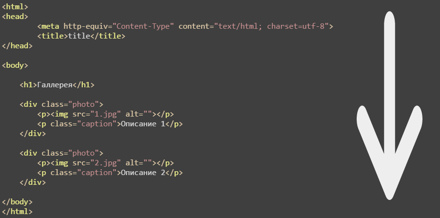
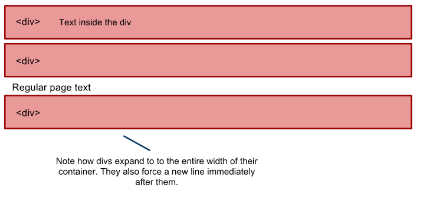
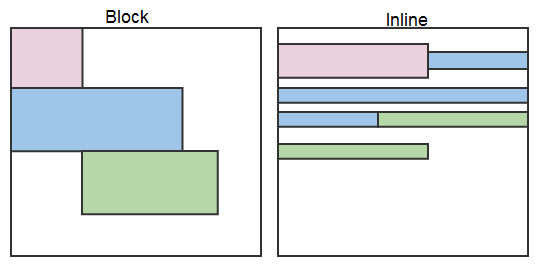
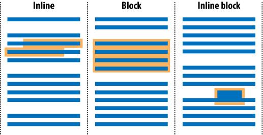

# Основы HTML. Часть 1

## Поток документа

Под "потоком документа" (flow) понимают порядок отображения элементов на странице.

Элементы, расположенные выше по коду, отображаются перед элементами, расположенными ниже. Такая логика делает результат вывода элементов страницы предсказуемым и управляемым.

## Блочные элементы

-   Блочные (block) элементы расположены один под другим

-   Такие элементы имеют ширину, высоту, отступы

-   Блоки занимают всю ширину родительского элемента. Например, если задать им фон, то фон будет виден по всей ширине родительского элемента

-   Так как блочный элемент занимает всю ширину, его внутренние элементы могут быть выровнены горизонтально, т.е. к левому, правому краю, посередине и по всей ширине

-   Блочный элемент может быть внутри другого блочного элемента

-   Свойства строчных элементов не предназначены для блочных элементов, например, вертикальное выравнивание (`vertical-align`)

К блочным элементам относятся:

-   `
` - раздел документа
-   `<h1>` - `<h6>` - заголовки
-   `<li>` - элемент списка
-   `
` - параграф
-   `<ul>` - маркированный список
-   `<ol>` - нумерованный список
-   `<dl>` - список определений
-   `<table>` - таблица
-   `<tr>` - строка таблицы

## Строчные элементы

-   В строчные (inline) элементы допускается вставлять текст и другие строчные элементы

-   В строчные элементы запрещено вставлять блочные

-   Высота строчных элементов не контролируется свойством `height`

-   Ширина пропорционально ширине контента

-   Строчные элементы расположены друг за другом в строке, могут переноситься на следующую строку при необходимости

-   Строчным элементам можно задать вертикальное выравнивание

К строчным элементам относятся:

-   `<a>` - ссылки
-   `<b>`, `<i>`, `` - работа со шрифтами
-   ` ` - переход на новую строку
-   `` - универсальный строчный элемент
-   `<th>` - ячейка заголовка в таблице
-   `<td>` - ячейка в таблице

## Строчно-блочные элементы

-   В строчно-блочных (inline-block) элементах возможно размещать текст или блочные элементы

-   Высота элемента рассчитывается автоматически браузером на основе контента

-   Ширина равна ширине контента с учетом отступов и границ

-   Inline-block элементы расположены в одной строке и переносятся на следующую при необходимости

-   Могут быть выровнены по вертикали

-   Допускается установка ширины и высоты

## Спецсимволы (named character references)

HTML интерпретирует символы `<`, `>`, `&`, `"` и др. как специальные. При необходимости их использования они заменяются на, соответственно, `&lt;`, `&gt;`, `&amp;`, `&quot;`.
